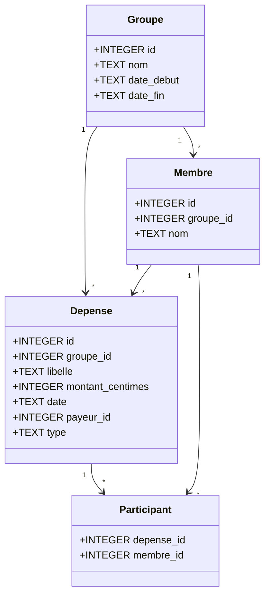

```mermaid
classDiagram
    class Groupe {
        +INTEGER id
        +TEXT nom
        +TEXT date_debut
        +TEXT date_fin
    }

    class Membre {
        +INTEGER id
        +INTEGER groupe_id
        +TEXT nom
    }

    class Depense {
        +INTEGER id
        +INTEGER groupe_id
        +TEXT libelle
        +INTEGER montant_centimes
        +TEXT date
        +INTEGER payeur_id
        +TEXT type
    }

    class Participant {
        +INTEGER depense_id
        +INTEGER membre_id
    }

    Groupe "1" --> "*" Membre
    Groupe "1" --> "*" Depense
    Membre "1" --> "*" Depense
    Depense "1" --> "*" Participant
    Membre "1" --> "*" Participant
```
